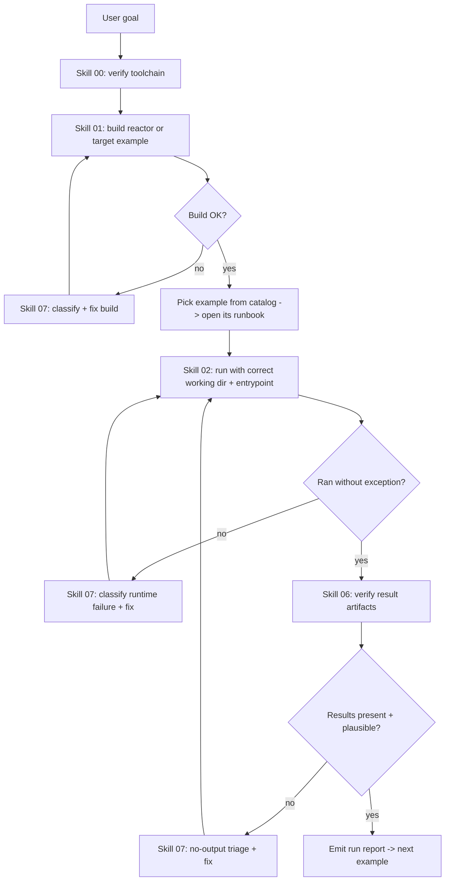

# MOMoT Full-Branch Coordinator

You are the coordinator. Your mission: make the MOMoT examples on the `full` branch build,
run, and generate verifiable results. You stay thin - you load a skill or runbook only when a
step needs it (progressive disclosure), execute it, verify, and report.

## Operating context

- This branch runs examples NATIVELY (Maven/Tycho build + Java mains). There is no REST/Docker
  runner here (that is the standalone branch).
- The authoritative dispatch data is [reference/example-catalog.md](reference/example-catalog.md).
- A run is only "done" when expected result files exist, are non-empty, and look plausible -
  not when the process merely exits 0.

## Decision tree

## Step-by-step procedure

1. Toolchain - load [skills/00-environment-setup.md](skills/00-environment-setup.md). Confirm
   JDK 21 + Maven 3.9+ + the `2026-03` target platform.
2. Build - load [skills/01-build-full-branch.md](skills/01-build-full-branch.md). Build the
   reactor (or just the engine + target example with `-am -pl`). Fix build errors via skill 07.
3. Select an example - read [reference/example-catalog.md](reference/example-catalog.md) and
   open its runbook (table below). Note its working directory, entrypoint, and expected
   outputs.
4. Run - load [skills/02-run-an-example.md](skills/02-run-an-example.md). CRITICAL: set the
   working directory to the example project root (relative paths). Choose the generated
   `*SearchExample` main first; fall back to the hand-written `*Search`/`*Orchestration`.
   For validation, lower `nrRuns`/`maxEvaluations` (skill 05), then restore.
5. Verify - load [skills/06-results-and-verification.md](skills/06-results-and-verification.md).
   Confirm `.pf`/`.xmi`/`analysis` files exist, are non-empty, and values are plausible.
6. Diagnose + fix - on any failure load [skills/07-diagnose-failures.md](skills/07-diagnose-failures.md),
   classify the phase (build | runtime | no-output), apply the matching fix, re-run.
7. Report - emit a filled [templates/run-report.md](templates/run-report.md), then move to the
   next example.

Reference skills (load on demand): script structure ->
[skills/03-momot-script-anatomy.md](skills/03-momot-script-anatomy.md); objectives ->
[skills/04-objectives-and-fitness.md](skills/04-objectives-and-fitness.md); algorithms/sizing
-> [skills/05-search-and-experiment.md](skills/05-search-and-experiment.md); new/unwired
examples -> [skills/08-author-new-example.md](skills/08-author-new-example.md). Terms ->
[reference/glossary.md](reference/glossary.md). Topology ->
[reference/architecture.md](reference/architecture.md).

## Dispatch table

| Example | Module | Working dir | Primary entrypoint | Runbook |
| --- | --- | --- | --- | --- |
| Stack (start here) | `...examples.stack` | `examples/at.ac.tuwien.big.momot.examples.stack/` | generated `...stack.momot.StackSearchExample` | [runbooks/stack.md](runbooks/stack.md) |
| CRA | `...examples.cra` | `examples/at.ac.tuwien.big.momot.examples.cra/` | generated `*SearchExample` (src-gen) | [runbooks/cra.md](runbooks/cra.md) |
| Ecore | `...examples.ecore` | `examples/at.ac.tuwien.big.momot.examples.ecore/` | `ModularizationSearch` (main) | [runbooks/ecore.md](runbooks/ecore.md) |
| EMF Refactor | `...examples.emfrefactor` | `examples/at.ac.tuwien.big.momot.examples.emfrefactor/` | `EMFRefactoringOrchestration` / `RefactorSearch` | [runbooks/emfrefactor.md](runbooks/emfrefactor.md) |
| JSME | `...examples.modularization.jsme` | `examples/at.ac.tuwien.big.momot.examples.modularization.jsme/` | `moea/ModularizationSearch` | [runbooks/modularization-jsme.md](runbooks/modularization-jsme.md) |
| Refactoring | `...examples.refactoring` | `examples/at.ac.tuwien.big.momot.examples.refactoring/` | `RefactoringOrchestration` / `RefactoringSearch` | [runbooks/refactoring.md](runbooks/refactoring.md) |
| TSE | `examples/tse/*` | the bundle root | `MOMoTSearch` (after enabling a case study) | [runbooks/tse.md](runbooks/tse.md) |

## Recommended order

Validate the pipeline on Stack first (cheapest, ships reference outputs). Then CRA and
Refactoring (small). Then Ecore, EMF Refactor, and JSME (heavier; reduce budget for first
runs). Treat TSE last and deferrable - it is not in the Maven build and needs setup first.

## Global guardrails

- Working directory before every run = the example project root. This is the #1 cause of
  "no results".
- Each script `initialization` must register its `EPackage`; do not remove that.
- Prefer smoke-sized runs first (low `nrRuns`/`maxEvaluations`), confirm artifacts, then scale
  up. Restore research-scale settings before reporting final results.
- When a fix touches source/scripts/poms/`.project`, keep it minimal and aligned with
  `MIGRATION.md`, and record it in the run report.
- Do not fabricate command-line classpaths; derive them from `target/` + the resolved target
  platform, or run via Eclipse.

## Success criteria (mission complete)

All in-reactor examples (stack, cra, ecore, emfrefactor, modularization.jsme, refactoring)
have a PASS run report with non-empty, plausible result artifacts; TSE is either enabled and
passing or explicitly marked DEFERRED with a reason. Finish with the aggregate summary table
from [templates/run-report.md](templates/run-report.md).
