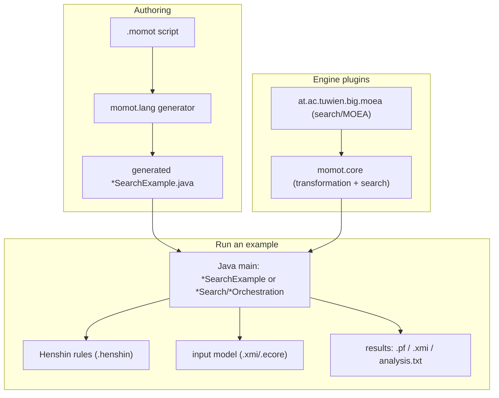
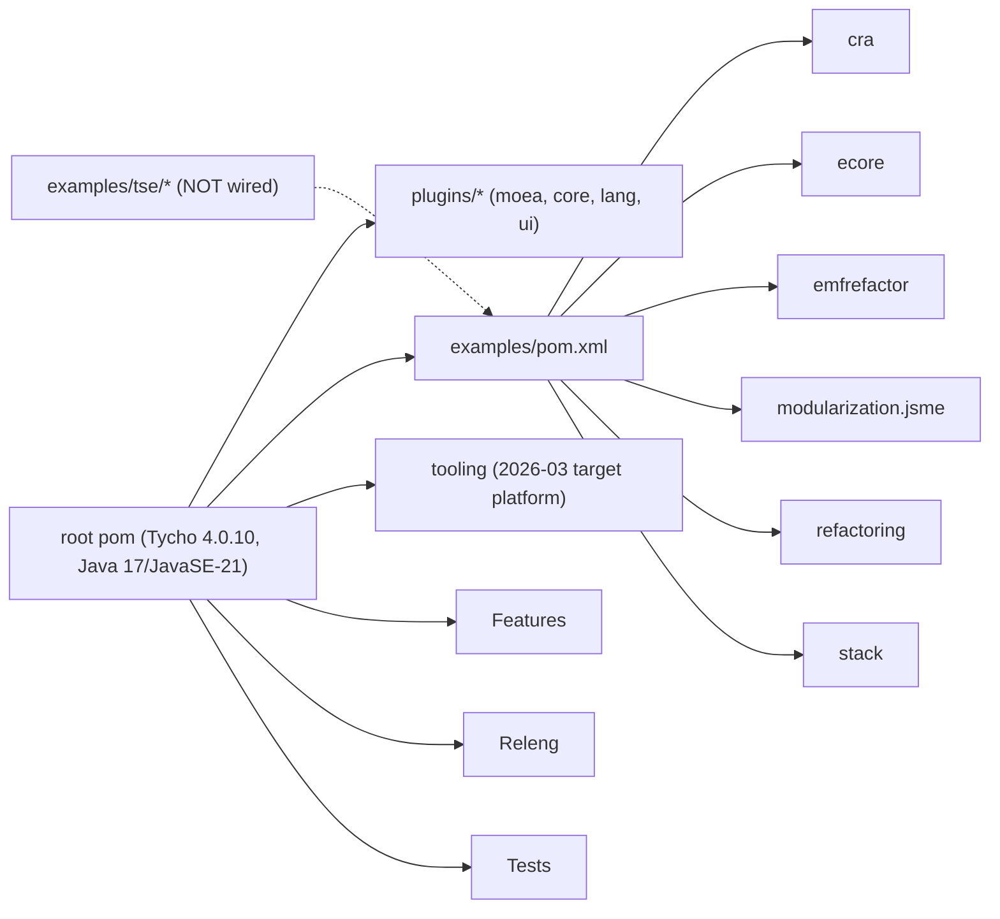
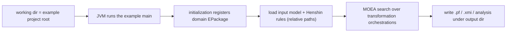

# Full-Branch Architecture

The `full` branch is the example-rich research codebase: the MOMoT engine plus seven example
families, built as a Maven/Tycho reactor and run as native Java applications. It does not
include the standalone branch's headless REST/Docker runner.

## What MOMoT does

MOMoT marries Model-Driven Engineering with Search-Based Software Engineering: it treats a
sequence of model-transformation rule applications (a Henshin orchestration) as a candidate
solution, and uses multi-objective metaheuristics (MOEA Framework: NSGA-II/III, eMOEA, local
search) to optimize models against domain objectives (coupling, cohesion, MQ, solution
length, ...).

## Layers

## Build topology

The TSE family lives under `examples/tse/` but is not referenced by any pom; it is Eclipse/PDE
only (see [../runbooks/tse.md](../runbooks/tse.md)).

## Run model (native)

The relative-path + working-directory contract is the most failure-prone link; see
[../skills/02-run-an-example.md](../skills/02-run-an-example.md).

## Full vs standalone

| Aspect | full (this branch) | standalone |
| --- | --- | --- |
| Contents | engine + 7 example families | engine + MCP server + REST runner + Docker |
| Run mechanism | native Java mains / generated runners | headless `/run` zip-in/zip-out over REST in Docker |
| Docs | this `docs/agents/` scaffolding | `doc/00`-`09`, `GEMINI.md` |
| Primary goal | make every example build, run, and produce results | reproducible headless job execution |

When a headless, reproducible run is needed, the standalone branch's approach can be ported,
but on `full` the supported path is native execution.
