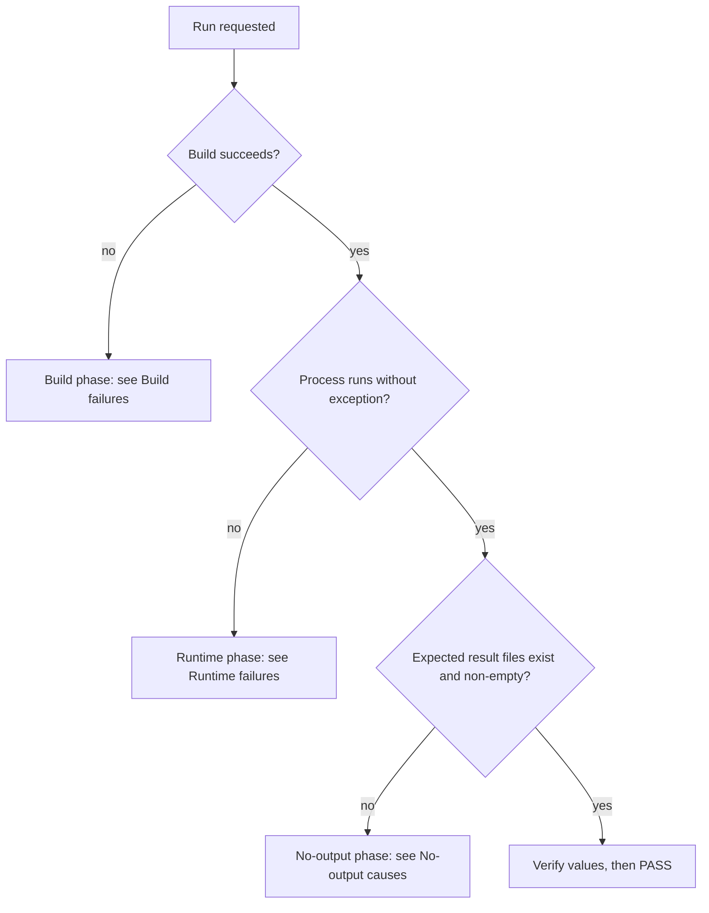

# Skill 07: Diagnose Failures

Use this triage tree to classify the failure first, then apply the matching fix. Always state
the failing phase in the run report.

## Triage tree

## Build failures

| Symptom | Cause | Fix |
| --- | --- | --- |
| `javax/inject/Provider` builder error | stale Xtext nature in an example `.project` | remove Xtext builder + `org.eclipse.xtext.ui.shared.xtextNature` (MIGRATION item 4) |
| MWE2 type error in `momot.lang` | old `Workflow{...}` MWE2 form | use direct `XtextGenerator` root (MIGRATION item 2) |
| `org.eclipse.ocl.OCL` cannot resolve | generic OCL API removed | use `org.eclipse.ocl.ecore.OCL` (MIGRATION item 3) |
| missing bundle on target resolution | bundle absent from `2026-03.target` | add it (skill 00) |
| class file version error | wrong JDK | build JDK 21, source/target 17 |

See [01-build-full-branch.md](01-build-full-branch.md).

## Runtime failures (exception thrown)

| Exception / message | Likely cause | Fix |
| --- | --- | --- |
| `FileNotFoundException` on the input model/Henshin | wrong working directory (relative paths) | set working dir to the example project root (skill 02) |
| EMF "package not registered" / unresolved proxy / `ClassCastException` on `root` | domain `EPackage` not registered | ensure `initialization` registers `XxxPackage.eINSTANCE`; ensure generated EMF model classes are on the classpath |
| `NoClassDefFoundError` for Henshin / MOEA / OCL / string-similarity | incomplete classpath outside Eclipse | reproduce the full PDE/target classpath; for ecore add `lib/java-string-similarity-0.13.jar` |
| OCL evaluation/initialization errors | OCL delegate not initialized | initialize the OCL delegate domain (note: TSE has this commented out) |
| Henshin variable binding lost during search | known engine issue addressed on standalone (`Preserve Henshin VAR bindings`) | ensure the engine build includes that fix; mutate variables via `TransformationVariableMutation` |
| headless `HeadlessException` / SWT/display error | a UI path invoked in a headless run | run the non-UI main; do not invoke the UI plugins headless |

## No-output causes (ran clean, nothing written)

1. Wrong working directory: outputs were written relative to wherever the JVM started. Search
   the filesystem for stray `output/` or `example/output/` directories.
2. The search never iterated: no `SeedRuntimePrintListener` lines on the console means the
   model/Henshin did not load or all units were ignored.
3. `results` block paths are not writable or point outside the project; create the parent
   directory or fix the path.
4. The example's `main` is a no-op: e.g. TSE's `MOMoTSearch.main` has all case studies
   commented out - uncomment/select one (see [../runbooks/tse.md](../runbooks/tse.md)).
5. Over-aggressive `ignoreUnits`: if every applicable rule is ignored, the search explores an
   empty space and produces trivial/empty solutions.

## Escalation

If a fix requires editing example sources, scripts, poms, or `.project` files, make the change
(this is expected when getting examples to run), keep it minimal and aligned with
`MIGRATION.md`, re-run, and record the fix in the run report.
